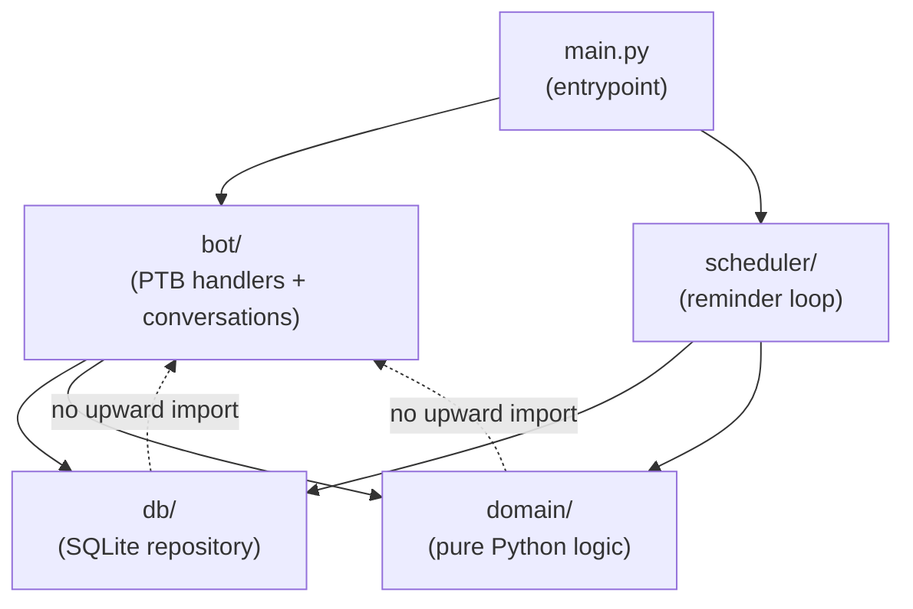
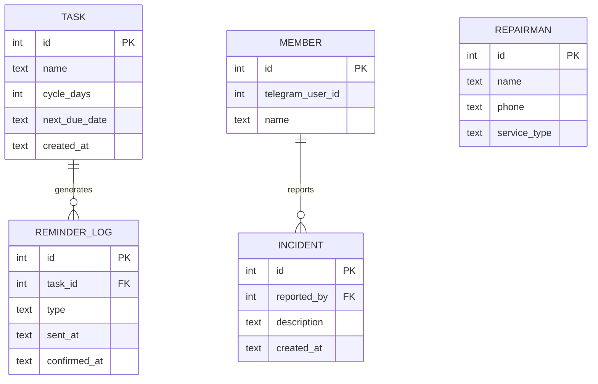

# Architecture Spine — HomeKeeper Agent

## Design Paradigm

**Layered** — four layers with strict downward-only dependency. Interface calls Application; Application calls Domain and Persistence; neither Domain nor Persistence may import upward.



`bot/` and `scheduler/` are **parallel application units** — they run in separate threads and must not share mutable state; the database is their only communication channel.

---

## Invariants & Rules

### AD-1 — Downward-only layer dependency

- **Binds:** all modules
- **Prevents:** circular imports; domain logic leaking into handlers; DB access scattered across the codebase
- **Rule:** import direction must follow `bot/ → domain/`, `bot/ → db/`, `scheduler/ → domain/`, `scheduler/ → db/`. `domain/` and `db/` have zero imports from `bot/` or `scheduler/`.

### AD-2 — Bot and scheduler communicate only through SQLite

- **Binds:** `bot/`, `scheduler/`
- **Prevents:** race conditions from shared in-memory state between the PTB event loop thread and the scheduler thread
- **Rule:** no module-level shared variables, queues, or events are passed between `bot/` and `scheduler/`. All coordination (e.g. "task was just confirmed") is read from the DB.

### AD-3 — Domain layer is pure Python

- **Binds:** `domain/`
- **Prevents:** business logic (next-due-date calculation, overdue check) becoming untestable without Telegram or SQLite
- **Rule:** `domain/` may import only the Python standard library. No `telegram`, `sqlite3`, or third-party imports.

### AD-4 — No outbound integration module (HITL structural enforcement)

- **Binds:** all
- **Prevents:** bot contacting external parties (repairmen, services) without user confirmation
- **Rule:** the codebase contains no HTTP client, no external API call, no dialer. `bot/` sends only Telegram messages. Any future external integration requires an explicit new module and a new AD.

### AD-5 — SQLite WAL mode; one connection per thread

- **Binds:** `db/`
- **Prevents:** write contention and `SQLITE_BUSY` errors between the PTB thread and scheduler thread
- **Rule:** database opened with `PRAGMA journal_mode=WAL` at startup. Each thread holds its own connection; connections are not passed across thread boundaries.

### AD-6 — Catch-up on restart

- **Binds:** `scheduler/`, `db/`
- **Prevents:** missed Reminders going undelivered after a machine restart
- **Rule:** on bot startup, `scheduler/catchup.py` queries `REMINDER_LOG` to determine which Tasks have already been reminded for their current `next_due_date`. Any Task whose `next_due_date ≤ now` and has no `REMINDER_LOG` row for that due date sends a catch-up Reminder immediately. `TASK` table carries no `last_reminder_sent` column — `REMINDER_LOG` is the sole authority on send history.

### AD-8 — Single writer for `TASK.next_due_date`

- **Binds:** `bot/reminder_callbacks.py`, `scheduler/loop.py`
- **Prevents:** race condition where scheduler logs a Reminder against a stale due date after user has already confirmed and rescheduled
- **Rule:** only `bot/reminder_callbacks.py` (via `db/task_repo.py`) may write `TASK.next_due_date`. `scheduler/loop.py` is read-only on `TASK`; before logging a Reminder send to `REMINDER_LOG`, it re-reads the Task row to confirm `next_due_date` has not changed since it decided to send. If changed, it skips the send for that tick.

### AD-7 — Conversation state is in-memory only

- **Binds:** `bot/`
- **Prevents:** over-engineering state persistence for a personal single-user bot
- **Rule:** PTB `ConversationHandler` default in-memory state is used. A restart mid-conversation resets the flow — the user starts the command again. No conversation state is written to SQLite.

---

## Consistency Conventions

| Concern | Convention |
|---------|-----------|
| File naming | `snake_case.py` for all modules; handler files named by feature (e.g. `task_handlers.py`, `incident_handlers.py`) |
| Entity IDs | integer primary keys, auto-incremented |
| Dates & times | stored as ISO-8601 strings in SQLite (`TEXT`); always UTC internally; converted to Vietnam time (UTC+7) only at display |
| Telegram user IDs | stored as `INTEGER` (Telegram user IDs are integers) |
| Error handling | handlers catch exceptions and reply with a plain-text error message to the user; never silently swallow |
| Config | Admin Telegram user ID and DB path read from environment variables at startup; no hardcoded values in code |
| Logging | standard `logging` module; INFO level for Reminder sends and user actions; DEBUG for scheduler ticks |

---

## Stack

| Name | Version |
|------|---------|
| Python | ≥ 3.12 |
| python-telegram-bot | ≥ 21.0 |
| SQLite | bundled with Python |

---

## Structural Seed

```text
homekeeper/
  bot/
    __init__.py
    task_handlers.py       # ConversationHandlers: add/edit/delete Task
    repairman_handlers.py  # add/edit/delete Repairman
    member_handlers.py     # add/remove Member
    incident_handlers.py   # report Incident, show Repairman suggestions
    reminder_callbacks.py  # inline keyboard callbacks (✅ Done, ⏭ Skip)
  scheduler/
    __init__.py
    loop.py                # background thread: poll every 60s, send due Reminders
    catchup.py             # startup scan for overdue Tasks
  db/
    __init__.py
    schema.sql             # CREATE TABLE statements
    connection.py          # open_db(), WAL pragma
    task_repo.py           # CRUD for Task
    repairman_repo.py      # CRUD for Repairman
    member_repo.py         # CRUD for Member
    reminder_log_repo.py   # insert/query Reminder send history
  domain/
    __init__.py
    scheduling.py          # next_due_date(task, confirmed_at) → date
    overdue.py             # is_overdue(task) → bool; hours_overdue(task) → int
    matching.py            # match_repairmen(service_type, repairmen) → list
main.py                    # wire PTB Application + scheduler thread, call catchup
.env                       # ADMIN_USER_ID, DB_PATH (not committed)
requirements.txt
```

**Core entity relationships:**



---

## Capability → Architecture Map

| Capability | Lives in | Governed by |
|-----------|----------|-------------|
| CAP-1: Task management | `bot/task_handlers.py` → `db/task_repo.py` | AD-1, AD-3 |
| CAP-2: Automated Reminders | `scheduler/loop.py` + `scheduler/catchup.py` → `db/reminder_log_repo.py` | AD-2, AD-5, AD-6 |
| CAP-3: Confirm + reschedule | `bot/reminder_callbacks.py` → `domain/scheduling.py` → `db/task_repo.py` | AD-1, AD-3 |
| CAP-4: Incident + Repairman suggestion | `bot/incident_handlers.py` → `domain/matching.py` → `db/repairman_repo.py` | AD-1, AD-3, AD-4 |
| CAP-5: Repairman directory + Member roster | `bot/repairman_handlers.py` + `bot/member_handlers.py` → `db/` | AD-1 |

---

## Deferred

- **Per-Task reminder time** — fixed at 08:00 UTC+7 for v1; per-Task customization is a new column + scheduler change, deferred to v1.1.
- **Multi-instance / multi-admin** — single Admin per deployment; multi-admin requires auth refactor, not in scope.
- **Webhook mode** — polling is sufficient for personal use; webhook needs a public HTTPS endpoint, deferred if bot moves to a server.
- **Database migrations** — schema is stable for v1; migration tooling (e.g. Alembic) deferred until schema needs to change.
- **Test infrastructure** — unit tests for `domain/` are straightforward (pure Python); integration test harness for handlers deferred post-v1.
